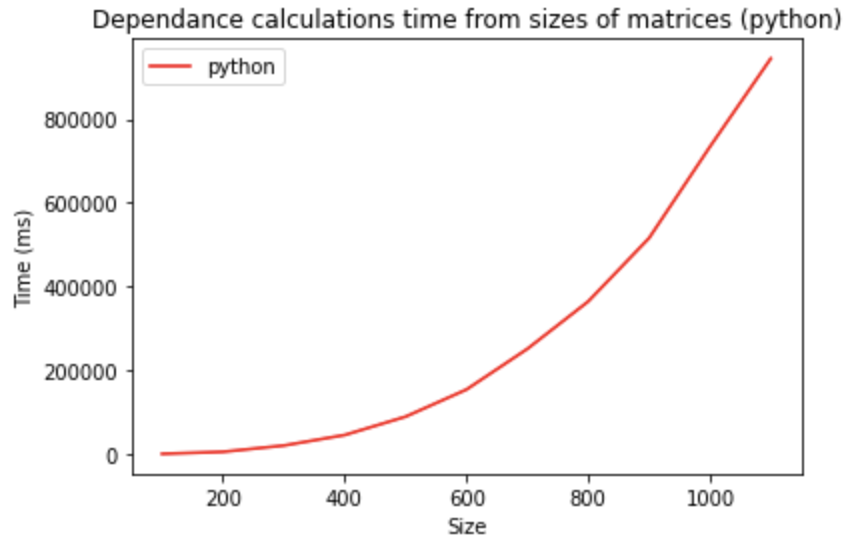
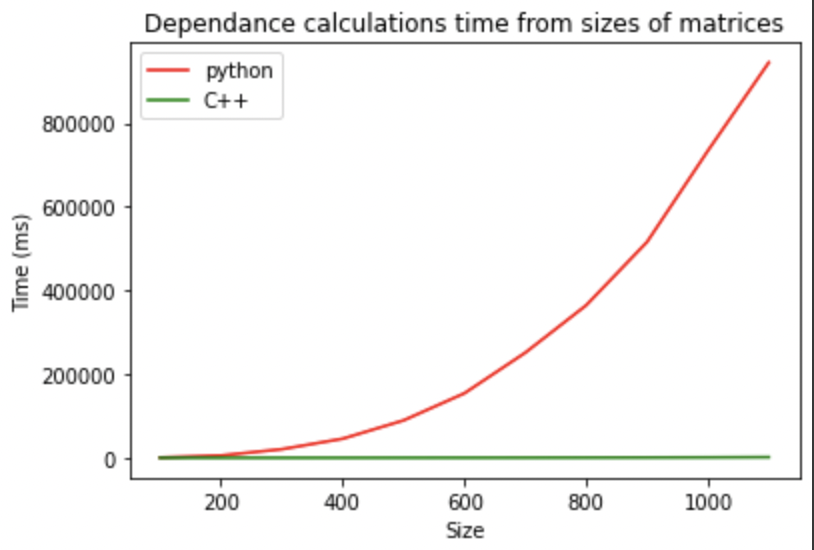

# Перемножение матриц и работа с одноядерными вычислениями

# Постановка задачи

Даны матрицы $A (M×N)$ и $B (P×R)$. Написать программу для расчета матрицы $C = AB^T$ без промежуточного формирования матрицы BT в явном виде. Размеры матриц согласованы для корректности перемножения.

Формат ввода:

M N

A[0,0] A[0,1] … A[0, N-1]

…

A[M-1,0] A[M-1,1] … A[M-1,N-1]

P R

B[0,0] B[0,1] … B[0, R-1]

…

B[P-1,0] B[P-1,1] … B[P-1,R-1]

Формат вывода: функция возвращает результат умножения.


# Архитектура проекта

- src/ - содержит main.cpp, запускающий создание и перемножение матриц, а также подсчет времени;
- include/ - содержит заголовочные файлы, нужные для запуска main.cpp, среди них: array_types.hpp с классом Matrix, в котором реализованы стандартные действия с матрицами; linalg.hpp с функцией перемножения матриц и timer.hpp с отсчетом времени выполнения перемножения;

- python/ - директория с main.py, в котором реализовано то же самое, что сделано на с++;
- build/ - директория для сборки;
- bin/ - папка с итоговым исполняемым файлом;
- data/ - содержит скрипт для генерации данных data_generator.cpp и сгенерированные файлы с входными данными в data/data_files.
---
- for_supercomputer/ - директория-аналог src, в которой всё собрано в один файл main.cpp. Сделано для простой компиляции через Makefile в связи с затруднением установки и использования cmake на суперкомпьютере.
- output/charisma_output.txt - файл, в котором хранится весь вывод, полученный при работе с суперкомпьютером.

# Запуск кода

Для запуска кода достаточно ввести команду в главной директории проекта
```bash
make
```
По умолчанию выбрана цель, подходящая для запуска на суперкомпьютере.

 В качестве входных данных будут использованы текстовые файлы из папки data.

 Для генерации данных используется команда
 ```
 make data_gen
 ```
 из исходной директории.

# Запуск кода на суперкомпьютере

Для компиляции файла на С++ использовались флаги -O3 -march=native. Команда из Makefile для компиляции выглядит так:

```
g++ -O3 -march=native for_supercomputer/main.cpp -o bin/for_supercomputer
```

Для запуска sh-скрипта использовалось:
```
sbatch -A proj_1339 bin/for_supercomputer.sh
```

В преамбуле sh-файла указывала следующую информацию:

```
#!/bin/sh
#SBATCH --cpus-per-task=1   # Требуемое кол-во CPU
#SBATCH --job-name=hw1      # Название работы
#SBATCH --constraint="type_d|type_c"  # Тип узла
```
На суперкомпьютере программа запускалась через Makefile командой make. В Makefile вызывался файл bin/for_supercomputer.sh. 

# Работа с одноядерными вычислениями

Работа с одноядерными вычислениями происходила на кластере "cHARISMa" ВШЭ.
Скриптом для запуска на суперкомпьютере является bin/for_supercomputer.sh.


# Графики производительности

Для упрощения представления информации на графике для вычислений использовались квадратные матрицы A(n, n), B(n, n). Тем не менее, все скрипты на C++ и python адаптированы для работы с прямоугольными матрицами. 

GFLOPs для матриц A(m, n), B(p, r) рассчитывалось по формуле 
```bash
GFLOPs = m * n * p * 2
```
Весь вывод, полученный при работе с суперкомпьютером, хранится в output/charisma_output.txt.


Также были получены графики зависимости времени нахождения произведения матриц от размеров матриц в миллисекундах:

- Для кода на С++


Максимальная вычислительная мощность была достигнута на матрицах размерности 2300.

- Для кода на python



Максимальная вычислительная мощность была достигнута на матрицах размерности 1100.


- Сравнение результатов



# Предположения о низкой производительности python

- Python - язык программирования с динамической типизацией в отличие от С++ (тип переменной не указывается при ее объявлении). Вероятно, именно это в значительной мере повлияло на производительность программы.

- Python - интерпретируемый язык, С++ - компилируемый. Код на python должен пройти этап преобразования, код же на плюсах сразу будет выполняться.